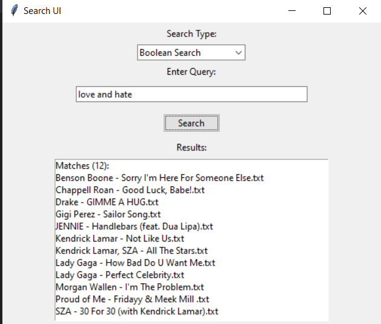

# NLP-and-IR
Natural Language Processing and Information Retrieval / 자연어처리 및 정보검색
Billboard Ranking from: https://www.billboard.com/charts/hot-100/
Date of Data 24.03.25

I have decided to get the top 100 Billboard Songs and use the lyrics including some additional data like artist, song name etc.
To get the lyrics i used https://www.lyricsify.com/ and then made it into an txt file.

The LR-Project is done in python since its simple and effective for the given assignemnt.

UI is working, the boolean search includes the AND, OR , NOT opperators wich work if not mixed and its not case or syntax sensitive yet(I will include that later on).

UI is very simple for now but I would like to improve it, wich would mean I would have to install some additional Dependencies (like pip install ttkbootstrap or similar stuff(is that allowed?))

TO START JUST START THE main.py :D 

More Info in the "Natural Language Processing and Information Retrieval.pdf"

## Images

Here are some images from the `testingAndPictures` folder:

